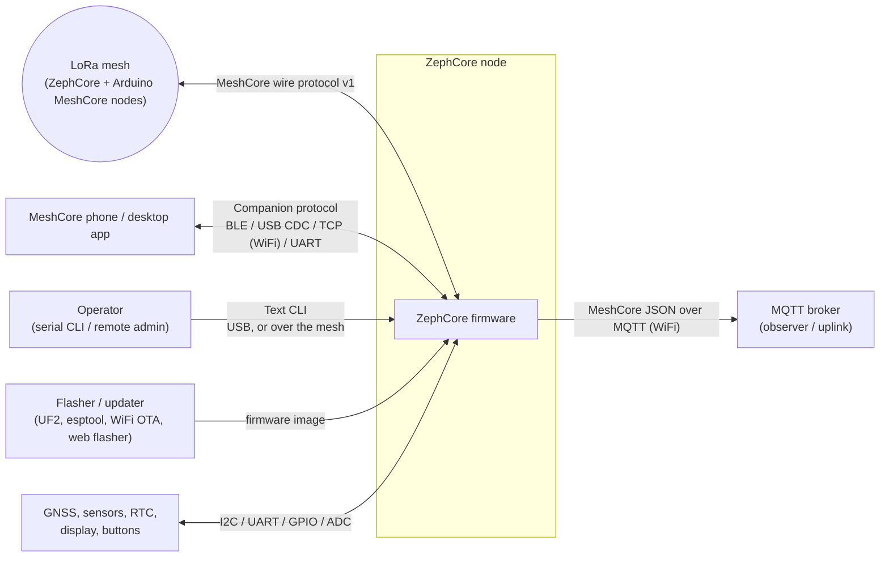
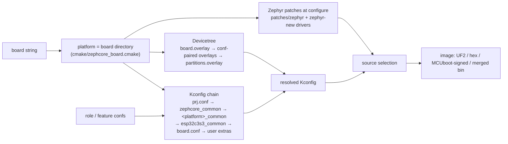
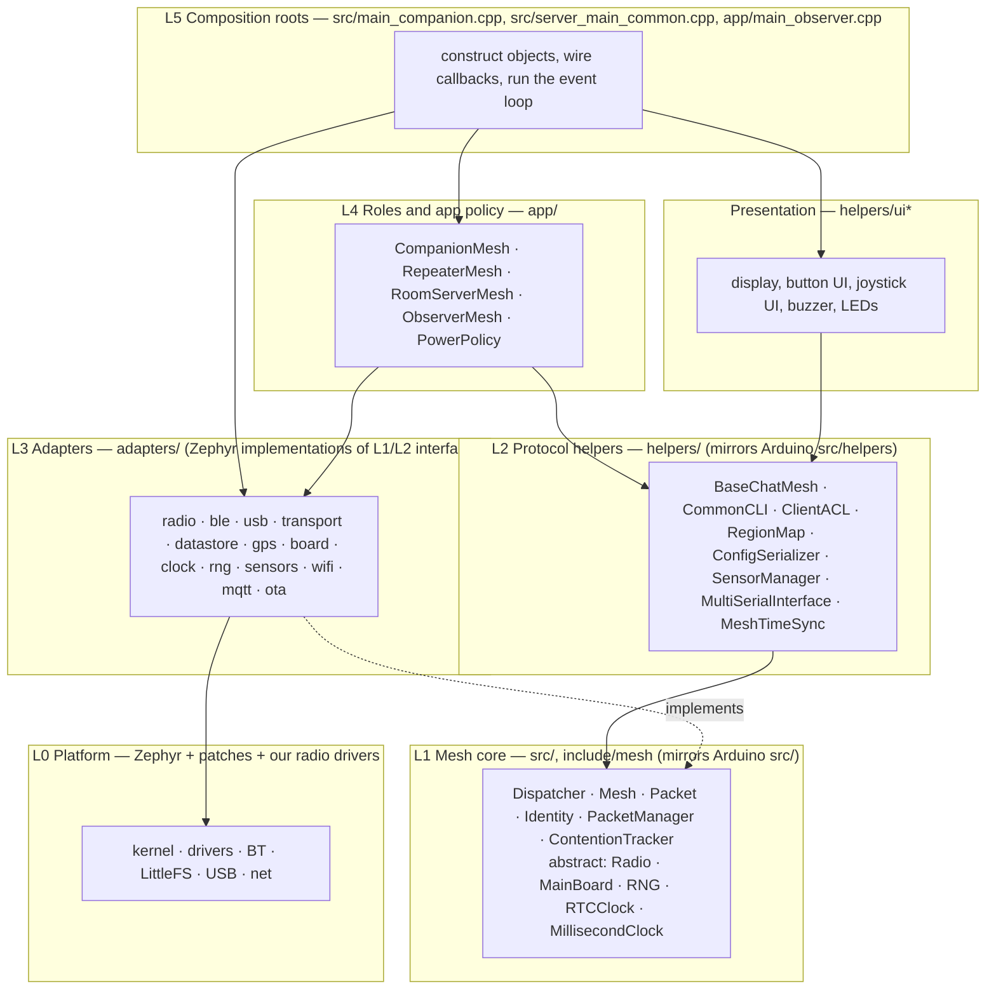
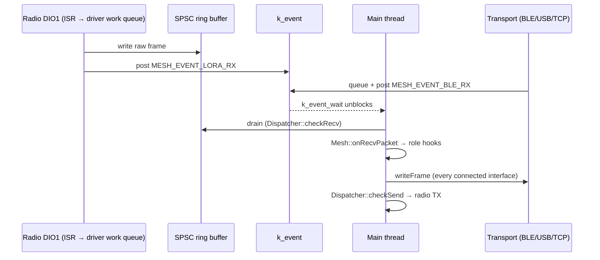

# ZephCore — System Design

> Version 1.0, 2026-09-25: the outcome of the 2026-09 restructure (twelve slices over build, core, radio,
> companion, server roles, event loops, connectivity, storage, peripherals, UI and the repository).
> This is the system view: what ZephCore is made of and the rules that keep it coherent. Component detail is in
> [ARCHITECTURE.md](ARCHITECTURE.md); decisions and their history are in [adr/](adr/README.md); the CLI is in
> [Repeater_CLI_commands.md](Repeater_CLI_commands.md). Where a **rule** is stated, known exceptions are listed
> in §5.3.

---

## 1. Purpose and scope

ZephCore is a Zephyr RTOS port of [Arduino MeshCore](https://github.com/meshcore-dev/MeshCore): LoRa mesh firmware
that interoperates on-air and app-side with stock MeshCore nodes, while running on Zephyr's driver model across
multiple MCU families.

### 1.1 Goals (in priority order)

1. **Interoperability** — byte-compatible with Arduino MeshCore on the air and on the companion protocol; prefs
   stored in upstream's `prefs.json` format.
2. **Robustness in the field** — a node must never silently go deaf, mute, or lose its identity; every stall has a
   bounded recovery (§8.7).
3. **Upstream portability** — most new mesh features arrive from Arduino MeshCore, so code that mirrors upstream
   stays structurally identical to it (§9).
4. **Hardware breadth** — one codebase across nRF52840, nRF54L15, the ESP32 family, EFR32MG24, STM32WL and native
   Linux, with four radio families.
5. **Resource discipline** — static allocation for the packet path; companion builds are RAM-bound.

### 1.2 Non-goals

- Replacing the MeshCore protocol or phone apps. ZephCore extends behind stable interfaces; it does not fork them.
- A hardware watchdog (decided; §8.7).
- Dynamic plugin loading. All variability is build-time (§4).

---

## 2. System context

| External actor | Interface | Compatibility rule |
|---|---|---|
| Other mesh nodes | MeshCore wire protocol v1 | **Frozen** to upstream. Never change on-air format unilaterally. |
| Phone / desktop app | Companion binary protocol (opcodes, push codes), CayenneLPP telemetry | Upstream is authoritative; ZephCore additions only in unused code space. Telemetry layout as upstream (battery, MCU temperature and GPS on channel 1, one channel per sensor from 2). |
| Operator | Text CLI | Upstream command names, semantics and reply texts are authoritative; additions documented. |
| MQTT broker | MeshCore JSON | Matches community ingest. |
| Flasher | UF2 / MCUboot image / merged `.bin` / WiFi OTA | Per platform ([ADR 0001](adr/0001-esp32-boot-and-flash-layout.md), [0002](adr/0002-esp32s3-native-usb-companion.md)). |

---

## 3. Roles

A **role** is a firmware personality chosen at build time. Exactly one role per image.

| Role | Purpose | Talks to | Arduino counterpart | Persisted root |
|---|---|---|---|---|
| Companion | Phone-paired chat node: contacts, channels, offline queue | App (BLE/USB/TCP/UART) | `examples/companion_radio` | `/lfs` (+ `/ext`) |
| Repeater | Autonomous relay: ACL, regions, neighbours, admin CLI | Operator | `examples/simple_repeater` | `/lfs/repeater/` |
| Room server | Store-and-forward board, per-client sync cursor | Operator + logged-in clients | `examples/simple_room_server` | `/lfs/repeater/` |
| Observer | Listen-only; publishes packets to MQTT (ESP32) | Broker | none (ZephCore-only) | `/lfs/repeater/` |

Roles share the mesh core; they differ in policy. **Switching between the companion and a server role formats the
volume** (the identity is lost unless exported first); repeater, room server and observer share one layout.

---

## 4. Build-time composition

A build is the tuple **(board, role, radio family, UI kind, optional features)**; the board fixes platform, radio
and UI, the user picks role and features.

| Dimension | Values | Selected by |
|---|---|---|
| Platform | nRF52840, nRF54L15, ESP32 classic, ESP32-S3/C3/C6, EFR32MG24, STM32WL, native Linux | board directory |
| Radio | SX126x family (default), LR1110, LR2021, SX127x | devicetree / board conf |
| Role | companion (default), repeater, room server, observer | user `EXTRA_CONF_FILE` |
| UI | none, button UI, joystick/keypad UI (companion) | board Kconfig select |
| Features | debug, WiFi companion, WiFi OTA, uplink, packet logging, PM | user confs; some auto-added |

The board list is one manifest per board (`zephcore.yml`), read by `build.sh`, the provider catalog and
`docs/supported_boards.md`.

**Rules**
- R4.1 A board directory declares hardware only (pins, peripherals, partitions, identity), never role policy.
- R4.2 CMake auto-includes a conf only where the combination is otherwise broken (repeater → WiFi OTA on
  S3/C-series; S3 companion → native USB; WiFi-capable companion → WiFi companion).
- R4.3 Later layers override earlier ones, for Kconfig and devicetree alike
  ([ADR 0003](adr/0003-devicetree-overlay-precedence.md)).
- R4.4 Each upstream Zephyr file has exactly one owning patch in `patches/`.

---

## 5. Logical architecture

### 5.1 Layers

| Layer | Directory | Mirrors upstream | May depend on | Must not depend on |
|---|---|---|---|---|
| L0 Platform | `zephyr/`, `patches/` | — | — | anything above |
| L1 Mesh core | `src/` (excl. mains), `include/mesh/` | `src/` | L1 interfaces, `lib/monocypher` | adapters, helpers, roles, UI |
| L2 Protocol helpers | `helpers/` | `src/helpers/` | L1 | roles, UI |
| L3 Adapters | `adapters/` | platform classes (`NRF52Board`, sensor managers, …) | L0, L1/L2 interfaces | roles, UI |
| L4 Roles | `app/` | `examples/*/MyMesh` | L1, L2, adapter interfaces | UI internals |
| Presentation | `helpers/ui*` | `examples/companion_radio/ui-*` | L2, the role-facing UI interface | concrete role classes (exception: §5.3) |
| L5 Composition roots | mains | `examples/*/main.cpp` | everything | — |

### 5.2 Dependency rules

- R5.1 Dependencies point downward. The composition roots are the only place that names concrete adapter types.
- R5.2 L1 and L2 stay structurally aligned with upstream (§9); Zephyr specifics enter through interfaces, never by
  editing shared logic inline.
- R5.3 Cross-cutting services (GPS, display, OTA, RTC) reach L2/L4 through narrow interfaces, injected by L5.
- R5.4 The UI talks to the mesh through events in (`ui_notify_*`) and actions out (`ui_mesh_actions`, applied on
  the main thread).
- R5.5 No include cycles.

### 5.3 Known exceptions

| # | Exception | Status |
|---|---|---|
| V2 | `helpers/CommonCLI.cpp` includes the GPS manager, `ZephyrBoard`, WiFi OTA and UI headers (it serves `gps sync`, `start dfu`, `start ota`, display and input rotation). Sensors and GPS settings go through upstream's `SensorManager` since 2026-09-25. | Accepted: the remaining includes serve ZephCore-only commands. |
| V3 | `helpers/boot_prefs.h` includes the GPS manager (applies GPS prefs at boot, as upstream's `applyGpsPrefs()`). | Accepted. |
| V4 | The joystick UI calls `CompanionMesh` directly. | **Accepted by decision**: it runs on the main thread, so the calls are safe, and upstream's UITask reads `the_mesh` the same way. One access point (`JoystickUITask::getMesh()`). |
| V5 | The MQTT adapter included `app/observer_creds.h`. | **Resolved 2026-09-26**: the credentials struct lives in `adapters/mqtt/uplink_creds.h`; the roles keep its persistence. |

### 5.4 Component inventory

| Component | Layer | Responsibility |
|---|---|---|
| Dispatcher, Mesh, Packet, PacketManager | L1 | TX/RX state machine, CAD/LBT gate, duty cycle, routing, dedup, adverts; 32-slot static pool |
| ContentionTracker | L1 (ZephCore) | adaptive flood jitter and reactive backoff ([ADR 0007](adr/0007-adaptive-contention-window.md)) |
| Identity / Utils | L1 | Ed25519/X25519 keys, AES/HMAC helpers |
| `LoRaRadio` + per-family ops tables | L3 | one `mesh::Radio` adapter over SX126x / LR11xx / LR20xx / SX127x drivers; RX-busy gate, noise floor, CAD ([ADR 0006](adr/0006-sx126x-rx-duty-cycle-and-busy-gating.md)) |
| BaseChatMesh, CompanionMesh | L2 / L4 | contacts, channels, messages; companion protocol (one handler per opcode), offline queue, v-contact |
| RepeaterMesh, RoomServerMesh, ObserverMesh | L4 | forwarding policy, ACL, regions, posts, MQTT |
| CommonCLI (+ ClientACL, RegionMap, TransportKeyStore) | L2 | the text CLI for every role, in upstream's shape |
| Companion transports | L3 | BLE, USB/UART, TCP as upstream `BaseSerialInterface`s in one `MultiSerialInterface` (broadcast) |
| WiFi / MQTT / OTA | L3 | ESP32 networking, uplink, HTTP OTA ([ADR 0009](adr/0009-wifi-companion-boards.md)) |
| DataStore (companion, server) | L3 / L4 | identity, `prefs.json` (upstream `ConfigSerializer`), contacts, channels, blobs ([ADR 0008](adr/0008-storage-and-settings-backend.md)) |
| ZephyrBoard, power-off | L3 | battery (cached), LEDs, reboot, bootloader, `powerOff()`, reset/shutdown reasons, crash record |
| GPS manager | L3 | main-thread state machine, module power and configuration (three files) |
| ZephyrSensorManager | L3 | upstream `SensorManager`: telemetry (`querySensors`), the `gps` setting |
| PowerPolicy | L4 | low-battery auto-shutdown and battery alert, every companion |
| UI (display, button UI, joystick UI) | Presentation | local interaction |

---

## 6. Runtime view

### 6.1 Threading model

The mesh is **single-threaded by design**: all mesh state (Dispatcher, Mesh, role objects, packet pool, GPS
state, the joystick UI) is owned by the Zephyr main thread, which blocks in `k_event_wait()` and never polls.
Everything else (radio DIO1 work, BLE host, USB, GNSS parsing, button UI, WiFi) runs in its own context and hands
off to the main thread through events and queues.

**Rules**
- R6.1 Mesh state is touched only on the main thread. Other contexts hand off via `k_msgq`, SPSC ring buffers,
  atomics + `k_event`. The GNSS callbacks only validate and snapshot a fix; the fix is delivered on the main thread.
- R6.2 ISR and driver work-queue code never calls into C++ mesh objects except the documented radio callbacks,
  which only enqueue and signal.
- R6.3 No busy-wait or unbounded blocking on the main thread.
- R6.4 The radio is RX 24/7; it is never PM-suspended.

### 6.2 Execution contexts

| Context | Stack | Runs |
|---|---|---|
| Main thread | 6 KB companion, 8 KB servers (4 KB observer, 6 KB STM32WL) | role event loop, all mesh state, GPS state machine, joystick UI loop |
| System work queue | 4 KB | timers, BLE/USB callbacks, button UI rendering, GNSS parsing, the hardware-RTC write |
| Radio DIO1 queues | per driver | IRQ decode, RX-busy latch, watchdogs |
| `lora_tx_wait` | 2 KB | TX-done wait (bounded), RX restart |
| `buzzer_wq`, `mqtt_pub_thread`, TCP listener | small / 12 KB / — | melodies; MQTT publish; TCP companion accept |

### 6.3 Main event loop

The main thread waits on `MESH_EVENT_ALL`; the shared bits are in `src/mesh_events.h` (LoRa RX 0, TX done 1,
transport or CLI RX 2, housekeeping/maintenance 3, GPS action 4, TX drain 5; bit 6 free; role bits from 7).
**Scheduling differs per role by design**: the repeater and room server are deadline-driven (the loop arms a
one-shot for the next due item, ~0.07 idle wakes/s), the companion keeps a periodic 5 s housekeeping tick because
it polls external state. Repeater and room server share one loop (`server_main_common.cpp`).

---

## 7. Key end-to-end flows

| Flow | Path |
|---|---|
| Receive and deliver | DIO1 → driver → ring buffer → `Dispatcher::checkRecv` → `Mesh::onRecvPacket` → decrypt → role hook → app frame / offline queue |
| Forward (repeater) | `onRecvPacket` → forwarding policy (disable_fwd, flood_max, region, rate) → path append → delayed retransmit with adaptive jitter |
| Send (companion) | app opcode → `handleCmdFrame` → per-opcode handler → `BaseChatMesh::sendMessage` → encrypt → `checkSend` → CAD/LBT → TX |
| Remote admin | ANON_REQ login → ACL → REQ with CLI text → `CommonCLI` → RESPONSE |
| Telemetry | REQ → permissions (guest: base only; inverse mask honoured) → battery, `sensors.querySensors()`, MCU temperature → CayenneLPP |
| Advert | periodic / on demand → signed advert → flood; receivers verify, update contacts/neighbours, feed MeshTimeSync |
| Persist | dirty contacts/channels flushed lazily; identity, prefs, channels by atomic replace |

---

## 8. Cross-cutting concerns

### 8.1 Memory
- The packet path is **heap-free**: 32-slot static pool, fixed tables.
- Companion RAM is the binding constraint; the levers are `MAX_CONTACTS` and the offline queue size. On PSRAM
  ESP32-S3 boards the WiFi heap and the `CompanionMesh` object live in PSRAM.
- R8.1: a new feature states its RAM cost per role.

### 8.2 Time
- Two clocks: monotonic milliseconds (all protocol timers) and wall-clock RTC (timestamps only).
- Invariant: wall-clock set paths are **forward-only**, except the GPS fix and `clkreboot`; a backward step mutes
  a node mesh-wide.
- Sources: GPS / manual set > mesh consensus (`MeshTimeSync`, opt-in) > hardware RTC. Every set also writes the
  hardware RTC when the board has one.

### 8.3 Power
- The radio never sleeps (RX 24/7; optional RX duty-cycle sniff inside the driver).
- One power-off path (`zephcore_power_off()`: loads off, LoRa in reset, wake button armed, power latch last),
  reached by `poweroff`, the UI and the low-battery policy.
- Low-battery policy for every companion (`PowerPolicy`): three low readings 30 s apart, never on external power,
  never on a reading under 2000 mV (no battery).
- GPS: duty-cycled; holds the SoC light-sleep lock only while acquiring.

### 8.4 Security
- On-air: Ed25519 identities, X25519 ECDH, AES-128 + truncated HMAC (upstream scheme).
- Companion link: BLE LE Secure Connections with passkey; pairing is reactive, never a proactive SMP request;
  privacy per platform ([ADR 0004](adr/0004-ble-privacy.md)).
- Server roles: password login, four permission levels, rate limits on login, anonymous requests and discovery.
- Entropy: hardware RNG with a seeded fallback.

### 8.5 Persistence
- LittleFS `/lfs` (internal) and optional `/ext` (QSPI). BLE bonds in NVS, isolated from LittleFS on nRF52/ESP32.
- Prefs are upstream's `prefs.json` (ZephCore fields under `zc`); the legacy binary layouts are migrated once and
  kept for downgrades.
- Atomic replace for identity, prefs and channels; contacts on `/ext` only.

### 8.6 Observability
- Zephyr logging per module; `debug.conf`; RTT on nRF, console on ESP32.
- CLI `get`/`stats-*`, `get pwrmgt.bootreason` (reset cause, shutdown reason, and the last fatal error with its pc).
- Host regression suite (`tests/`, CI with ASan/UBSan) over the production sources.

### 8.7 Fault handling and recovery
- **No hardware watchdog** (deliberate). Every stall-prone state machine owns a bounded software recovery in the
  layer that owns the state (radio parked-RX, RX-latch deadline, CAD timeout, BLE TX timeout, advertising
  watchdog, parser resyncs).
- R8.2: a new blocking wait or latch ships with its bound and its recovery.
- Fatal errors reboot (`fatal_reboot.c`) and leave a record for the next boot.

---

## 9. Upstream alignment policy

| Class | Meaning | Examples | Policy |
|---|---|---|---|
| **Shared** | ported from Arduino, same responsibility | Mesh, Dispatcher, Packet, Identity, BaseChatMesh, ClientACL, RegionMap, TransportKeyStore, MultiSerialInterface, ConfigSerializer, SensorManager, LPPDataHelpers (listed in `.editorconfig`) | Upstream text verbatim; every ZephCore change fenced `// ZEPHCORE:`, so a diff against upstream shows only intentional divergence. Arduino APIs come from `helpers/compat/`. |
| **Upstream-shaped** | ZephCore files built in upstream's shape | CompanionMesh, RepeaterMesh, RoomServerMesh, CommonCLI | Upstream names, order and replies where upstream has the feature; ZephCore additions marked. |
| **Extension** | ZephCore-only mesh behaviour | ContentionTracker, MeshTimeSync, ObserverMesh, RX-busy gating, PowerPolicy | Own files, attached through hooks. |
| **Platform** | replaces upstream's Arduino/board layer | adapters, mains, drivers, UI | Free to follow Zephyr idioms. |

Where a ZephCore-owned port can be more accurate than upstream at no compatibility cost, it is (the compat
CayenneLPP encoder rounds where the library truncates); upstream bugs found this way are fixed in our copy
(fenced) and reported.

---

## 10. Decisions

Recorded as ADRs in [adr/](adr/README.md): ESP32 boot and flash layout (0001), S3 native-USB companion (0002),
overlay precedence (0003), BLE privacy (0004), the Zephyr `main` pin (0005), SX126x duty cycle and RX-busy gating
(0006), adaptive contention window (0007), storage and settings backend (0008), WiFi companion boards (0009).

Principles recorded in this document rather than as ADRs: the single-threaded mesh (§6.1), the heap-free packet
path (§8.1), no hardware watchdog (§8.7), forward-only wall clock (§8.2), one owner per patched Zephyr file (R4.4),
upstream alignment (§9).

---

## 11. Open structural items

1. `CompanionMesh.cpp` (~3.5k lines) and `CommonCLI.cpp` (~2k) remain the largest files, though now in upstream's
   shape (one handler per opcode; upstream command layout).

None beyond that: the items left open at the end of the restructure (V5, the GPS off sequences, the ESP32 reset
cause) were closed on 2026-09-26.
